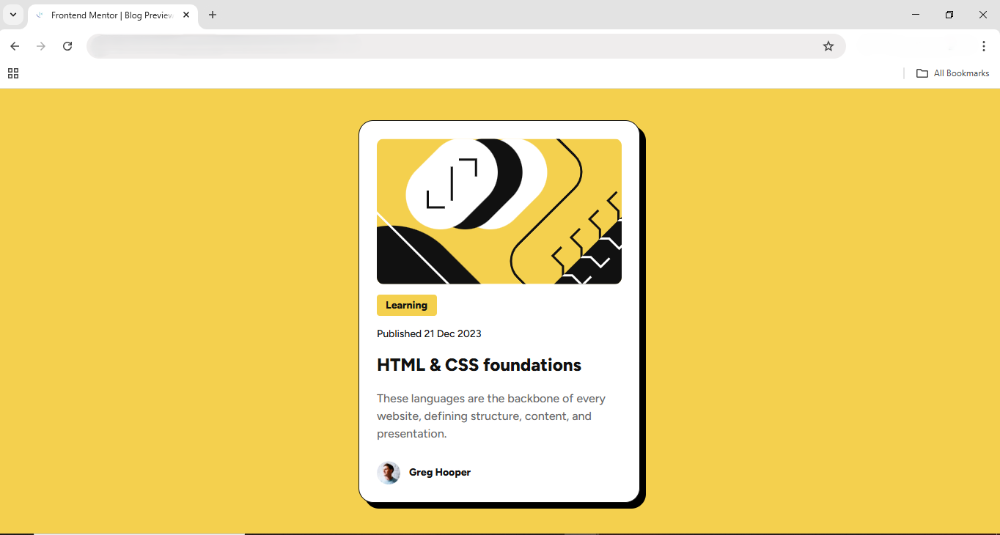

🎨 Blog Preview Card

This is my solution to the [Blog Preview Card challenge on Frontend Mentor](https://www.frontendmentor.io/solutions/blog-preview-card-solution-e3WfhbdXU0)

🚀. The goal was to build a responsive blog card that matches the Figma design, with a hover effect on the title. I worked on the desktop version first, then adapted it for mobile using media queries.

📸 Screenshot

✨ What I Learned

🎨 How to turn a Figma design into a real webpage.

📐 Using flexbox to align and space elements nicely.

✨ Adding a hover effect on the title link.

📏 Using media queries to make the card responsive for different screen sizes.

💻 Planning the desktop layout first and then adapting it for mobile.

🛠 Skills Used

HTML5

CSS (Flexbox, responsive design, hover effects, media queries)

🔗 Solution / Repo: [GitHub Repository](https://github.com/ZK-code-dev/blog-preview-card)

🌐 Live Preview

Check it out live here: [View Live Site](https://zk-code-dev.github.io/blog-preview-card/blog-preview-card-main/)
🚀
